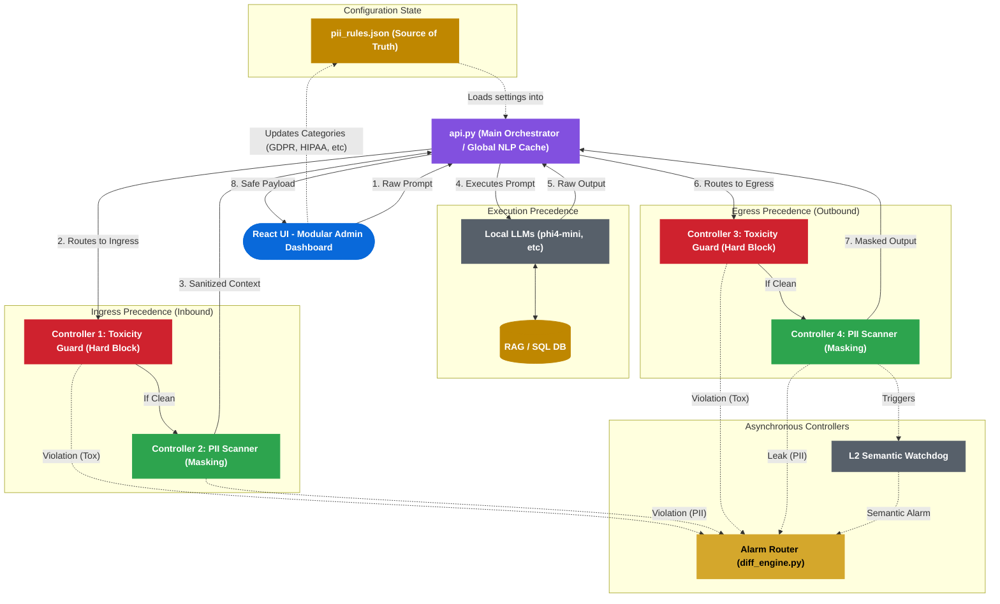

# Enterprise AI Governance System - Architectural Control Flow

This document outlines the architectural flow of the AI Governance Sandbox, explicitly detailing the **Control Precedence** (which controller executes before which) across the system. 

The architecture operates on a strict **fail-fast, defense-in-depth** hierarchy.

## Controller Hierarchy & Precedence Diagram

## Control Precedence: Step-by-Step

### 1. The Global State Controller (`pii_rules.json`)
Before any request is handled, the state of the system is defined by `pii_rules.json`. This acts as the absolute source of truth. 
* The **Frontend Dashboard** interacts with the API to update this file, dictating which categories (GDPR, Financial, HIPAA) are active.
* `api.py` caches the heavy NLP model globally to prevent latency during state changes.

### 2. The Main Orchestrator (`api.py`)
`api.py` (FastAPI) is the **Main Controller**. It receives the inbound HTTP requests and acts as a central switchboard, routing data through the guardrails in a strict, sequential order. 

### 3. Ingress Precedence (Inbound Security)
When the user sends a prompt, it must pass through the Ingress Pipeline before it ever reaches the AI.

* **1st Precedence: Toxicity Guard (`toxicity_guard.py`)**
  * **Why it's first:** Toxicity is a "fatal" error. If a prompt is severely abusive or a threat, there is no reason to spend CPU cycles running complex Regex matching or LLM inference. It is immediately hard-blocked and dropped.
* **2nd Precedence: PII Guardrail (`presidio_engine.py`)**
  * **Why it's second:** If the prompt is polite/clean, the system must ensure the user isn't accidentally uploading sensitive data (like a Credit Card or SSN) into the LLM's context window. The text is mutated/masked here.

### 4. Execution Controller
Once sanitized by both Ingress controllers, `api.py` hands the payload over to the LLM (Ollama) and the retrieval systems (SQL/RAG). The LLM processes the data and generates a raw response.

### 5. Egress Precedence (Outbound Security)
The LLM's output cannot be trusted. Before sending it back to the user, `api.py` routes the raw output through the Egress Pipeline.

* **3rd Precedence: Egress Toxicity Guard**
  * **Why it's first:** Just like Ingress, if the AI hallucinates and generates obscene or hateful text, the text must be instantly destroyed. There is no need to mask PII in a hateful sentence that the user will never be allowed to see.
* **4th Precedence: Egress PII Guardrail**
  * **Why it's second:** If the AI's response is safe, the system must ensure the AI didn't accidentally leak sensitive Database information (e.g., retrieving an unmasked IBAN number from the SQL DB). The PII scanner masks the sensitive data, and the final safe string is returned to the user via `api.py`.

### 6. Asynchronous Precedence (Auditing)
Running parallel to (and entirely detached from) the critical path:
* **The Alarm Router (`diff_engine.py`)**: Subscribes to failure events from the guardrails. If a guardrail mutates or blocks text, it asynchronously routes alarms to `alarms.json`.
* **L2 Semantic Watchdog**: A background LLM that reads the final interaction log to hunt for semantic leaks (e.g., hiding a password inside a poem) that the rigid Regex scanners couldn't catch.
