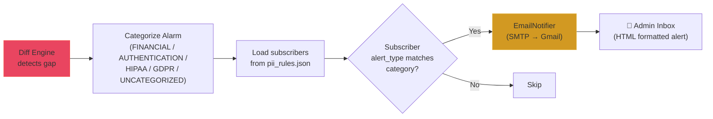

# AI-Governance Project — Architecture & Workflow Analysis

## 1. Project Structure

```
D:\AI-Governance\
├── api.py                    # FastAPI backend — all endpoints (732 lines)
├── llm_watchdog.py           # Layer 2 — Phi-4 Mini semantic PII analyzer
├── diff_engine.py            # Compares L1 vs L2 findings, generates alarms
├── notifications.py          # Email alert dispatcher (SMTP)
├── custom_recognizers.py     # Aadhaar Verhoeff checksum recognizer
├── audit_logger.py           # Secure audit trail (SHA-256 hashed inputs)
├── database.py               # SQLite customer DB (cohort.db)
├── fidelity_check.py         # Keyword-overlap fidelity scorer
├── pii_rules.json            # Dynamic rule config (hot-reloadable)
├── test_cases.json           # 16 test scenarios (Financial, Auth, HIPAA, GDPR)
├── alarms.json               # Active alarms (pending review)
├── alarms_archive.json       # Historical alarm ledger
├── governance_audit.json     # Audit trail log
├── cohort.db                 # SQLite database
├── frontend/
│   └── src/
│       ├── App.jsx           # Root — tab navigation + alarm badge
│       ├── Dashboard.jsx     # Testing dashboard (run test cases)
│       ├── AdminConfig.jsx   # Rule management, alarms, subscribers, sandbox
│       ├── AnalyticsDashboard.jsx  # Charts & metrics
│       ├── api.js            # API client (22 endpoints)
│       ├── index.css         # Global styles
│       └── main.jsx          # Vite entry point
```

---

## 2. System Architecture

```mermaid
graph TB
    subgraph Frontend["Frontend (React + Vite — :5173)"]
        APP["App.jsx<br/>Tab Navigation + Alarm Badge"]
        DASH["Dashboard.jsx<br/>Testing Dashboard"]
        ADMIN["AdminConfig.jsx<br/>Rules • Alarms • Subscribers • Sandbox"]
        ANALYTICS["AnalyticsDashboard.jsx<br/>Charts & Metrics"]
        APIJS["api.js<br/>22 API Functions"]
        
        APP --> DASH
        APP --> ADMIN
        APP --> ANALYTICS
        DASH --> APIJS
        ADMIN --> APIJS
        ANALYTICS --> APIJS
    end

    subgraph Backend["Backend (FastAPI — :8000)"]
        direction TB
        
        subgraph Guardrail["Universal Egress Guardrail"]
            direction LR
            L1["Layer 1: Presidio<br/>(en_core_web_lg +<br/>en_ner_bc5cdr_md)"]
            L1ANON["Anonymizer<br/>(Mask/Redact)"]
            L1 --> L1ANON
        end
        
        subgraph Watchdog["Async Watchdog (BackgroundTasks)"]
            direction LR
            L2["Layer 2: Phi-4 Mini<br/>(llm_watchdog.py)"]
            DIFF["Diff Engine<br/>(diff_engine.py)"]
            L2 --> DIFF
        end
        
        subgraph Sandbox["AI Sandbox"]
            SUGGEST["sandbox_suggest_rule<br/>(Phi-4 generates regex)"]
            TEST["sandbox_test_rule<br/>(Isolated Presidio test)"]
        end
        
        subgraph Config["Configuration Engine"]
            RELOAD["reload_presidio_engine()<br/>(Hot Reload)"]
            RULES["pii_rules.json<br/>(Rules + Settings + Subscribers)"]
            RELOAD <--> RULES
        end
        
        AUDIT["AuditLogger<br/>(SHA-256 hashed inputs)"]
        NOTIF["EmailNotifier<br/>(SMTP Alerts)"]
    end

    subgraph External["External Services"]
        OLLAMA["Ollama (:11434)<br/>phi4-mini:3.8b"]
        SQLITE["SQLite<br/>(cohort.db)"]
    end

    subgraph Storage["File Storage"]
        ALARMS_F["alarms.json<br/>(Active)"]
        ARCHIVE_F["alarms_archive.json<br/>(Historical)"]
        AUDIT_F["governance_audit.json<br/>(Audit Trail)"]
    end

    APIJS -->|"HTTP REST"| Backend
    L2 -->|"POST /api/chat"| OLLAMA
    SUGGEST -->|"POST /api/chat"| OLLAMA
    Backend -->|"SQL queries"| SQLITE
    DIFF -->|"Write"| ALARMS_F
    DIFF -->|"Write"| ARCHIVE_F
    DIFF -->|"Trigger"| NOTIF
    AUDIT -->|"Write"| AUDIT_F
    RELOAD -->|"Read"| RULES

    style Frontend fill:#0d1117,stroke:#58a6ff,stroke-width:2px
    style Backend fill:#0d1117,stroke:#3fb950,stroke-width:2px
    style External fill:#0d1117,stroke:#d29922,stroke-width:2px
    style Guardrail fill:#112211,stroke:#3fb950
    style Watchdog fill:#221122,stroke:#d29922
    style Sandbox fill:#1a1a2e,stroke:#bc8cff
```



---

## 3. Backend Module Dependency Map

```mermaid
graph LR
    API["api.py<br/>(Main Entrypoint)"]
    
    API --> LLM["llm_watchdog.py"]
    API --> DIFF["diff_engine.py"]
    API --> DB["database.py"]
    API --> AUDIT["audit_logger.py"]
    API --> CUST["custom_recognizers.py"]
    API --> FID["fidelity_check.py"]
    
    DIFF --> NOTIF["notifications.py"]
    
    LLM -->|"HTTP"| OLLAMA["Ollama<br/>phi4-mini:3.8b"]
    DB -->|"SQLite"| COHORT["cohort.db"]
    AUDIT -->|"JSON"| AUDIT_F["governance_audit.json"]
    DIFF -->|"JSON"| ALARMS["alarms.json"]
    API -->|"JSON"| RULES["pii_rules.json"]

    style API fill:#0f3460,stroke:#58a6ff
    style LLM fill:#533483,stroke:#bc8cff
    style DIFF fill:#e94560,stroke:#f85149
    style NOTIF fill:#d29922,stroke:#e3b341
```



---

## 4. Core Workflow — Egress Guardrail (Real-Time + Async)

This is the primary workflow that runs on every request (`/govern_ai`, `/query_db`, `/chat`):

```mermaid
sequenceDiagram
    participant User as User / Data Source
    participant API as FastAPI (api.py)
    participant Presidio as Layer 1 (Presidio)
    participant Anon as Anonymizer
    participant Audit as AuditLogger
    participant Out as Response to User
    participant BG as BackgroundTask
    participant Phi4 as Layer 2 (Phi-4 Mini)
    participant Diff as Diff Engine
    participant Alarms as alarms.json
    participant Email as EmailNotifier
    participant Admin as Admin Dashboard

    User->>API: POST /govern_ai {text}
    
    rect rgb(17, 34, 17)
        Note over API,Out: ⚡ HOT PATH (~15-30ms)
        API->>Presidio: analyze(text, entities, lang="en")
        API->>Presidio: analyze(text, entities, lang="en-US")
        Presidio-->>API: Combined results (NER + Medical)
        API->>Anon: anonymize(text, results)
        Anon-->>API: masked_output
        API->>Audit: log_transaction(SHA256_hash, masked_output)
        API-->>Out: ✅ Sanitized response
    end
    
    rect rgb(34, 17, 34)
        Note over BG,Email: 🔍 ASYNC WATCHDOG (Non-blocking)
        API->>BG: add_task(run_watchdog_task)
        BG->>BG: Check pii_rules.json → watchdog enabled?
        BG->>Phi4: POST /api/chat (semantic analysis)
        Phi4-->>BG: {findings: [...], has_sensitive_data: true}
        BG->>Diff: run_diff(raw_text, L1_results, L2_results)
        Diff->>Diff: Compare L1 masked values vs L2 findings
        
        alt L2 found something L1 missed
            Diff->>Alarms: Save alarm (active + archive)
            Diff->>Email: Send alert to subscribers
            Email-->>Admin: 🚨 Email notification
        else Both agree (or L2 found nothing)
            Diff->>Diff: Silent pass ✅
        end
    end
```



---

## 5. Chatbot Agentic Workflow (`/chat`)

The chatbot has a unique multi-turn agentic flow with tool use:

```mermaid
sequenceDiagram
    participant User as User
    participant API as FastAPI
    participant Phi4 as Phi-4 Mini (Ollama)
    participant DB as SQLite (cohort.db)
    participant Guard as Egress Guardrail
    participant Out as Response

    User->>API: POST /chat {"message": "Get details for customer 101"}
    
    rect rgb(20, 20, 40)
        Note over API,Phi4: Step 1: Initial LLM Call
        API->>Phi4: System: "Output <FETCH_DB:ID> if you need data"
        Phi4-->>API: "<FETCH_DB:101>"
    end
    
    rect rgb(20, 40, 20)
        Note over API,DB: Step 2: Tool Execution
        API->>API: Regex match: <FETCH_DB:(\d+)>
        API->>DB: SELECT * FROM customers WHERE id = 101
        DB-->>API: Raw customer data (name, phone, card, aadhaar, pan)
    end
    
    rect rgb(40, 20, 40)
        Note over API,Phi4: Step 3: Feed Data Back to LLM
        API->>Phi4: "Here is the DB result: {...}. Respond with JSON."
        Phi4-->>API: Structured JSON with customer data
    end
    
    rect rgb(17, 34, 17)
        Note over API,Out: Step 4: Egress Guardrail
        API->>Guard: apply_egress_guardrail(ai_response)
        Guard-->>API: masked_output (PII redacted)
        API-->>Out: ✅ Safe response to user
    end
    
    Note over API: Step 5: Async watchdog runs in background
```



---

## 6. Alarm → Sandbox → Rule Fix Workflow (Admin)

This is the self-improving feedback loop:

```mermaid
sequenceDiagram
    participant Admin as Admin (Dashboard)
    participant API as FastAPI
    participant Phi4 as Phi-4 Mini
    participant Sandbox as Sandbox Presidio
    participant Rules as pii_rules.json
    participant Presidio as Production Presidio

    Note over Admin: 🚨 Admin sees alarm in Threat Panel
    Admin->>API: Click "Fix in Sandbox" on alarm
    
    rect rgb(26, 26, 46)
        Note over API,Phi4: AI-Assisted Regex Generation
        API->>Phi4: POST /sandbox_suggest_rule
        Note right of API: "Generate regex for this API key pattern"
        Phi4-->>API: {"entity": "OPENAI_API_KEY", "regex": "\\bsk-proj-[A-Za-z0-9]{48,}\\b"}
        API-->>Admin: Display suggested entity + regex
    end
    
    rect rgb(20, 40, 20)
        Note over Admin,Sandbox: Sandbox Testing (Isolated)
        Admin->>Admin: Admin edits regex if needed
        Admin->>API: POST /sandbox_test_rule
        API->>Sandbox: Spin up isolated AnalyzerEngine
        Sandbox->>Sandbox: Test regex against context snippet
        Sandbox-->>API: {caught: true, matched_text: "sk-proj-4P9kLmN..."}
        API-->>Admin: ✅ "Regex caught the leak!"
    end
    
    rect rgb(17, 34, 17)
        Note over Admin,Presidio: Deploy to Production
        Admin->>API: POST /add_rule (Promote to Live)
        API->>Rules: Write new rule to pii_rules.json
        API->>Presidio: reload_presidio_engine() (Hot Reload)
        API-->>Admin: "Rule deployed and active ✅"
        Admin->>API: POST /delete_alarm (Resolve alarm)
    end
    
    Note over Presidio: ✅ Next time this pattern appears,<br/>Layer 1 catches it automatically
```



---

## 7. NLP Engine Architecture (Multi-Model)

```mermaid
graph TB
    subgraph PresidioEngine["Presidio Analyzer Engine"]
        direction TB
        
        subgraph NLP["Multi-Model NLP Engine"]
            EN["en_core_web_lg<br/>(SpaCy — General NER)<br/>lang: en"]
            MED["en_ner_bc5cdr_md<br/>(SciSpaCy — Medical NER)<br/>lang: en-US"]
        end
        
        subgraph Recognizers["Recognizer Registry"]
            BUILTIN["Built-in Recognizers<br/>• PERSON (SpaCy NER)<br/>• EMAIL_ADDRESS<br/>• US_SSN<br/>• PHONE_NUMBER"]
            ALGO["Algorithmic Recognizer<br/>• IN_AADHAAR (Verhoeff Checksum)"]
            DYNAMIC["Dynamic JSON Rules<br/>• CREDIT_CARD (regex)<br/>• IN_PAN (regex)<br/>• API_KEY (regex)<br/>• IBAN_NUMBER (regex)<br/>• MRN_NUMBER (regex)<br/>• GEOGRAPHIC_COORDINATES (regex)"]
            MEDICAL["Medical Recognizer<br/>• DISEASE (SciSpaCy NER)"]
        end
    end
    
    INPUT["Raw Text Input"] --> EN
    INPUT --> MED
    EN --> BUILTIN
    EN --> ALGO
    EN --> DYNAMIC
    MED --> MEDICAL
    
    BUILTIN --> MERGE["Merge Results"]
    ALGO --> MERGE
    DYNAMIC --> MERGE
    MEDICAL --> MERGE
    MERGE --> ANON["Anonymizer<br/>(Mask with <ENTITY_TYPE>)"]

    style PresidioEngine fill:#0d1117,stroke:#3fb950,stroke-width:2px
    style NLP fill:#112211,stroke:#238636
    style Recognizers fill:#161b22,stroke:#58a6ff
```



---

## 8. Data Flow — Complete Request Lifecycle

```mermaid
graph TB
    subgraph Input["3 Entry Points"]
        E1["/govern_ai<br/>(AI/LLM output)"]
        E2["/query_db<br/>(Database retrieval)"]
        E3["/chat<br/>(Agentic chatbot)"]
    end

    subgraph HotPath["⚡ Hot Path (Synchronous)"]
        FORK["Request Fork"]
        P1["Presidio (en) — General NER"]
        P2["Presidio (en-US) — Medical NER"]
        COMBINE["Combine Results"]
        ANON["Anonymize"]
        HASH["SHA-256 Hash<br/>(raw input)"]
        LOG["Audit Log<br/>(governance_audit.json)"]
        RESP["Sanitized Response<br/>→ User"]
    end

    subgraph AsyncPath["🔍 Async Path (BackgroundTask)"]
        CHECK["Check watchdog enabled?<br/>(pii_rules.json)"]
        PHI4["Phi-4 Mini<br/>(Ollama :11434)"]
        DIFFCMP["Diff Engine<br/>(Value comparison)"]
        DECIDE{"L2 found<br/>something<br/>L1 missed?"}
        ALARM["Generate Alarm"]
        SAVE["Save to<br/>alarms.json +<br/>archive"]
        NOTIFY["Email Subscribers"]
        NOOP["Silent Pass ✅"]
    end

    E1 --> FORK
    E2 --> FORK
    E3 --> FORK
    
    FORK -->|"Original"| P1
    FORK -->|"Original"| P2
    P1 --> COMBINE
    P2 --> COMBINE
    COMBINE --> ANON
    ANON --> HASH
    HASH --> LOG
    ANON --> RESP
    
    FORK -->|"Copy (async)"| CHECK
    CHECK -->|"Enabled"| PHI4
    PHI4 --> DIFFCMP
    COMBINE -.->|"L1 results"| DIFFCMP
    DIFFCMP --> DECIDE
    DECIDE -->|"Yes"| ALARM
    DECIDE -->|"No"| NOOP
    ALARM --> SAVE
    ALARM --> NOTIFY

    style HotPath fill:#112211,stroke:#3fb950,stroke-width:2px
    style AsyncPath fill:#221122,stroke:#d29922,stroke-width:2px
```



---

## 9. API Endpoint Catalog

### Core Guardrail Endpoints

| Endpoint | Method | Purpose |
|---|---|---|
| `/govern_ai` | POST | Mask PII in AI/LLM output text |
| `/query_db` | POST | Fetch customer from SQLite → mask PII |
| `/chat` | POST | Agentic chatbot with tool-use → mask PII |

### Configuration Endpoints

| Endpoint | Method | Purpose |
|---|---|---|
| `/rules` | GET | Get all PII rules + settings |
| `/add_rule` | POST | Add/upsert rule + hot-reload Presidio |
| `/update_rule` | POST | Update existing rule + hot-reload |
| `/delete_rule` | POST | Delete rule + hot-reload |
| `/toggle_watchdog` | POST | Enable/disable Layer 2 watchdog |

### Alarm Endpoints

| Endpoint | Method | Purpose |
|---|---|---|
| `/alarms` | GET | Get active (pending) alarms |
| `/delete_alarm` | POST | Dismiss/resolve alarm + update archive |

### Sandbox Endpoints

| Endpoint | Method | Purpose |
|---|---|---|
| `/sandbox_suggest_rule` | POST | Phi-4 generates regex for missed entity |
| `/sandbox_test_rule` | POST | Test regex in isolated Presidio instance |

### Subscriber Endpoints

| Endpoint | Method | Purpose |
|---|---|---|
| `/subscribers` | GET | Get notification subscribers |
| `/add_subscriber` | POST | Add email subscriber |
| `/update_subscriber` | POST | Update subscriber details |
| `/delete_subscriber` | POST | Remove subscriber |

### Analytics & Data Endpoints

| Endpoint | Method | Purpose |
|---|---|---|
| `/analytics` | GET | Metrics, trends, category breakdown |
| `/test_cases` | GET | Get test case definitions |

---

## 10. Frontend Views

```mermaid
graph TB
    subgraph AppShell["App.jsx — Shell"]
        NAV["Tab Navigation"]
        BADGE["Alarm Badge<br/>(polls /alarms every 5s)"]
    end

    subgraph Views["3 Main Views"]
        subgraph DashView["Dashboard.jsx — Testing"]
            TC["Test Case Runner<br/>(16 scenarios)"]
            TC1["AI Generative Tests"]
            TC2["DB Query Tests"]
            TC3["Chatbot Tests"]
        end
        
        subgraph AdminView["AdminConfig.jsx — Admin"]
            RP["Rule Panel<br/>(CRUD + hot-reload)"]
            AP["Alarm Panel<br/>(Review + Dismiss + Sandbox Fix)"]
            SP["Subscriber Panel<br/>(Email alerts CRUD)"]
            SB["Sandbox<br/>(AI Suggest → Test → Deploy)"]
            WD["Watchdog Toggle<br/>(Enable/Disable L2)"]
        end
        
        subgraph AnalyticsView["AnalyticsDashboard.jsx — Metrics"]
            METRICS["KPI Cards<br/>(Requests, Alarms, Resolved)"]
            TREND["Traffic + Alarm Trend Chart"]
            CATPIE["Category Distribution Pie"]
            TF["Timeframe Selector<br/>(24h / 7d / 30d / 90d / All)"]
        end
    end

    NAV --> DashView
    NAV --> AdminView
    NAV --> AnalyticsView

    style AppShell fill:#0d1117,stroke:#58a6ff
    style DashView fill:#112211,stroke:#3fb950
    style AdminView fill:#221122,stroke:#bc8cff
    style AnalyticsView fill:#1a1a2e,stroke:#d29922
```



---

## 11. Notification Flow



---

## 12. Technology Stack Summary

| Layer | Technology | Role |
|---|---|---|
| **Frontend** | React + Vite (port 5173) | Admin UI — 3 views |
| **Backend** | FastAPI (port 8000) | REST API — 18 endpoints |
| **PII Detection (L1)** | Microsoft Presidio | Rule-based NER + custom recognizers |
| **NLP Models** | SpaCy `en_core_web_lg` + SciSpaCy `en_ner_bc5cdr_md` | General + Medical entity recognition |
| **PII Detection (L2)** | Phi-4 Mini via Ollama (port 11434) | Semantic watchdog + regex generation |
| **Database** | SQLite (cohort.db) | Customer data store |
| **Notifications** | SMTP (Gmail) | Email alerts to subscribers |
| **Audit** | JSON file (SHA-256 hashed inputs) | TrustArc compliant logging |
| **Config Store** | pii_rules.json | Dynamic rules, settings, subscribers |
